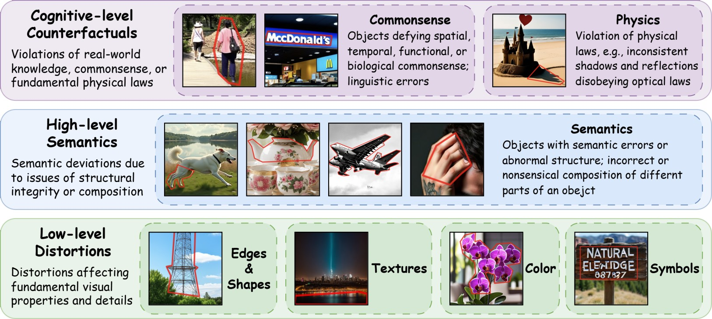

# Unveiling Perceptual Artifacts: A Fine-Grained Benchmark for Interpretable AI-Generated Image Detection

<p align="center">
  <a href="https://arxiv.org/abs/2601.19430"></a>
  <a href="https://huggingface.co/datasets/Coxy7/X-AIGD"></a>
</p>

This repository contains the dataset and code for **X-AIGD**, a fine-grained benchmark designed for **eXplainable AI-Generated image Detection**. X-AIGD provides pixel-level human annotations of perceptual artifacts in AI-generated images, spanning low-level distortions, high-level semantics, and cognitive-level counterfactuals, aiming to advance robust and explainable AI-generated image detection methods. 


## 🎨 Artifact Taxonomy

We define a comprehensive artifact taxonomy comprising 3 levels and 7 specific categories to capture the diverse range of perceptual artifacts in AI-generated images.

<p align="center">
  
</p>

*   **Low-level Distortions**: Fundamental visual irregularities, e.g., edge misalignments, unnatural textures.
*   **High-level Semantics**: Abnormal object structures and semantic inconsistencies.
*   **Cognitive-level Counterfactuals**: Violations of commonsense or physical laws.


## 🚀 Key Features

*   **Pixel-level Grounding**: Provides 18,000+ artifact instances across 3,000+ annotated samples with categorization and polygon mask localization.
*   **Diverse Generators**: Collects 52,000 fake images from 13 text-to-image models, which covers:
    * Different architectures: diffusion UNets, diffusion Transformers, auto-regressive models
    * Popular, up-to-date models: e.g., SD 3.5, FLUX.1-dev, and PixArt-α
    * Community fine-tuned models focusing on realism (from [Civitai](https://civitai.com/)): e.g., [SD3.5L-iPhonePhoto](https://civitai.com/models/738556?modelVersionId=987578)
*   **Semantic Alignment**: Features paired real and fake images with consistent semantics for unbiased interpretability assessment.
*   **Multi-level Analysis**: Enables systematic evaluation of model reliance on human-interpretable cues vs. opaque statistical features.


## 📅 Current Status & TODO

We are currently preparing the dataset and code for public release. Stay tuned!

- [WIP] **X-AIGD dataset**: Pixel-level annotated subset and full image collection.
  - The core labeled data have been released on [Hugging Face](https://huggingface.co/datasets/Coxy7/X-AIGD)
- [Planned] **Dataset-related scripts**: Scripts for dataset processing, metric calculation, etc.
- [Planned] **Experiment code**: Code for model training and evaluation.


## 📝 Citation

If you find our work useful in your research, please consider citing:

```bibtex
@article{xiao2026unveiling,
  title={Unveiling Perceptual Artifacts: A Fine-Grained Benchmark for Interpretable AI-Generated Image Detection},
  author={Xiao, Yao and Chen, Weiyan and Chen, Jiahao and Cao, Zijie and Deng, Weijian and Yang, Binbin and Dong, Ziyi and Ji, Xiangyang and Ke, Wei and Wei, Pengxu and Lin, Liang},
  journal={arXiv preprint arXiv:2601.19430},
  year={2026}
}
```


## 📄 License

This project is released under the [Apache 2.0 License](LICENSE).
